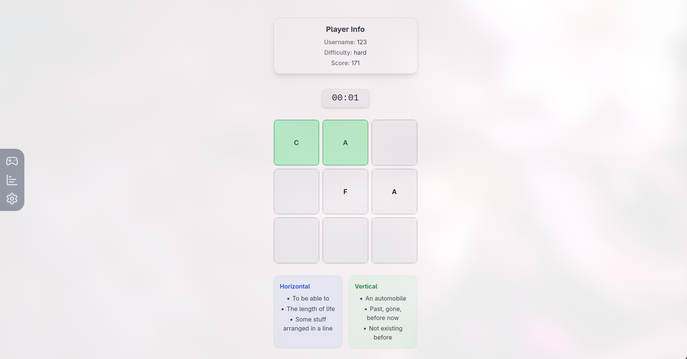

# 🧩 Crossword Game

[](LICENSE)
[](https://github.com/Lordenko/react-crossword/commits/main)
[](https://github.com/Lordenko/react-crossword/issues)
[](https://github.com/Lordenko/react-crossword/stargazers)

> An **interactive crossword game** built with **React**, **TypeScript**, **Zustand**, and **Formik/Yup**.  
> Track multiple players, difficulty levels, and scores with a responsive, modern UI.

---

## 🌟 Features

- Multi-player support with `localStorage` persistence  
- Dynamic difficulty: `easy`, `medium`, `hard`  
- Timer-based scoring system  
- Horizontal & vertical crossword hints  
- Portal modals for:
  - Game Over
  - Pre-Start
  - Score Summary  
- Settings page for username and difficulty  
- Fully responsive UI  
- Modern React Hooks + Zustand state management  

---

## 📸 Demo



---

## 🚀 Getting Started

```bash
git clone https://github.com/Lordenko/react-crossword.git
cd react-crossword
npm install
npm run start

```

---

## 🗂 Project Structure

```plaintext

src/
├─ app/               # Main application logic or core files
├─ assets/            # Static files (images, fonts, potentially shared data)
├─ components/        # Reusable UI components
│  ├─ Game/           # Components specific to the Game Page
│  ├─ Layaout/        # Components for general page structure
│  ├─ Results/        # Components specific to displaying results or scores
│  └─ Settings/       # Components specific to the Settings Page 
├─ hooks/             # Custom hooks for reusable logic
├─ pages/             # Application pages (screens)
├─ states/            # Global state management files (e.g., Zustand stores)
├─ types/             # TypeScript types and interfaces
```

---

## 🎮 Usage

Welcome to the game! Follow these steps to get started:

* **Setup:** Go to the **Settings** section and set your **username** and preferred **difficulty** level.
* **Start the Game:** Initiate the Game and begin filling in the crossword puzzle.
* **Scoring:** The **Timer** counts down. Be quick — **faster solutions** yield significantly **higher scores**!
* **Game Over:** When the game ends, the **Game Over Portal** will appear, showing your final **score**. From the portal, you will have options to:
    * **Retry** the current level.
    * Proceed to the **next difficulty** level.

---

## 🏆 Scoring

Your final score is calculated based on the difficulty multiplier and the time remaining when the puzzle is solved.

| Difficulty | Multiplier | Calculation |
| :--- | :--- | :--- |
| Easy | 1× | 1 × (Time Remaining) |
| Medium | 2× | 2 × (Time Remaining) |
| Hard | 3× | 3 × (Time Remaining) |

The score is dynamically updated as soon as the crossword is successfully solved.

---

## 🛠 Technologies

This project is built using the following core technologies:

* **Frontend:** React + TypeScript (for strong typing and component-based architecture)
* **State Management:** **Zustand** (lightweight and fast state management)
* **Forms & Validation:** **Formik** and **Yup**
* **Styling:** **Tailwind CSS** (utility-first CSS framework)
* **Routing:** **React Router** (for navigation)

---

## 🤝 Contributing

We welcome contributions! If you want to contribute, please follow these steps:

1.  **Fork** the repository.
2.  Create a new branch: `git checkout -b feature/your-feature`
3.  Commit your changes: `git commit -m 'feat: your message'`
4.  Push to your branch: `git push origin feature/your-feature`
5.  Open a **Pull Request** (PR).